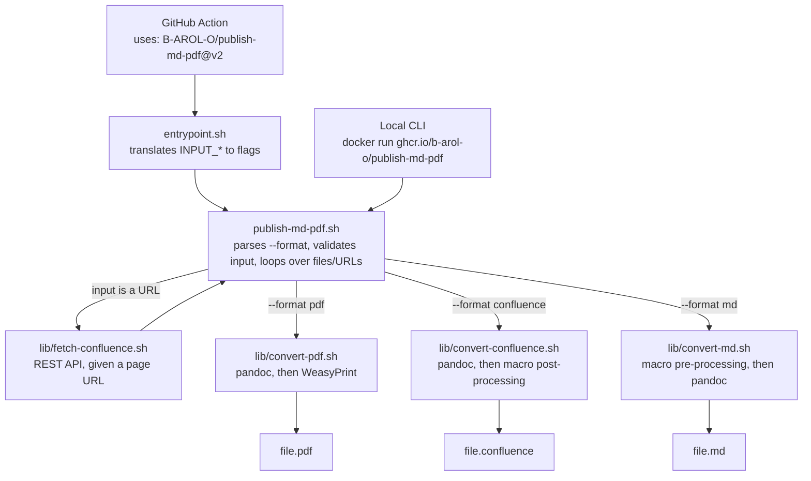
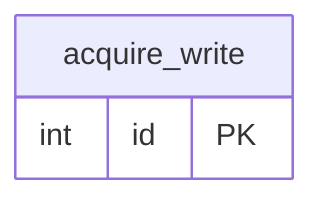

# publish-md-pdf

Render Markdown files to A4-sized PDF, using [pandoc](https://pandoc.org/) with the
[WeasyPrint](https://weasyprint.org/) PDF engine. By default, each `<file>.md` is written as
`<file>.pdf` into the current working directory. Fenced ` ```mermaid ` code blocks are
rendered as actual diagrams — see [Rendering Mermaid diagrams](#rendering-mermaid-diagrams). It can
also convert Markdown to and from Confluence Storage Format (the XHTML-based fragment the Confluence
REST API expects in its `body.storage.value` field) — see
[Converting to/from Confluence](#converting-tofrom-confluence) — and import a Confluence Cloud page
directly from its URL — see
[Importing a Confluence page by URL](#importing-a-confluence-page-by-url).

Shipped as a container image (`ghcr.io/b-arol-o/publish-md-pdf`) and as a Docker-based GitHub Action,
so it can be used both as a local CLI (via `docker run`) and in CI.

## Architecture

Every conversion goes through one entry point, `publish-md-pdf.sh`, and `--format` selects which one
runs. The GitHub Action reaches the same flags through `entrypoint.sh`, which only translates
`INPUT_*` environment variables — it makes no routing decisions of its own.



`lib/common.sh` holds the helpers every format shares (tool checks, input validation, output-name
resolution). The conversion modules are sourced, not executed, and each one exposes the same two
functions — `convert_<format>_init` and `convert_<format>_file` — so adding a format means adding a
module and one row to the format table in `publish-md-pdf.sh`. `lib/fetch-confluence.sh` sits
alongside them and is only invoked when an input is a URL — see
[Importing a Confluence page by URL](#importing-a-confluence-page-by-url).

## Usage

### As a CLI (via Docker)

```bash
docker run --rm -v "$PWD:/workspace" ghcr.io/b-arol-o/publish-md-pdf:v2 \
  [--format FORMAT] [--output-dir DIR] [--output-name NAME] [--css-file FILE] \
  [--no-attachments] <file|url> [file2|url2 ...]
```

- `--format FORMAT` — the conversion to perform (default: `pdf`, or `md` if every input is a URL —
  see [Importing a Confluence page by URL](#importing-a-confluence-page-by-url)):
  - `pdf` — Markdown (`.md`) to A4-sized PDF
  - `confluence` — Markdown (`.md`) to Confluence Storage Format
  - `md` — Confluence Storage Format (`.confluence`) back to Markdown

  `--to` is accepted as an alias.

- `--output-dir DIR` — directory to write the output file(s) into (default: `/workspace`, i.e. the
  mounted `$PWD`). Created if it doesn't already exist.
- `--output-name NAME` — filename for the output (default: derived from the input filename, or from
  the page title for a fetched Confluence URL). Only valid when converting a single input. The
  target extension is appended automatically if not already present.
- `--css-file FILE` — style sheet to use (default: the image's built-in `publish-md-pdf.css`). Only
  valid with `--format pdf`; combining it with another format is an error. A custom style sheet
  should keep the `.task-checkbox` rules from the default one (see [Notes](#notes)) if the source
  Markdown has GFM task lists (`- [ ]` / `- [x]`).
- `--no-attachments` — don't download the attachments of a fetched Confluence Cloud page; see
  [Images and other attachments](#images-and-other-attachments).

Paths outside `$PWD` (a different `--output-dir`, a custom `--css-file`) need their own bind mount,
since the script only sees paths inside the container.

The container has no `USER` directive and always runs as root — required so the GitHub Action can
write into GitHub's mounted `GITHUB_WORKSPACE` (see the `Dockerfile`'s comment) — so every file it
writes into a bind-mounted `$PWD` is root-owned on the host. For local CLI use, add
`--user "$(id -u):$(id -g)" -e HOME=/tmp` to get output owned by your own user instead:

```bash
docker run --rm --user "$(id -u):$(id -g)" -e HOME=/tmp -v "$PWD:/workspace" \
  ghcr.io/b-arol-o/publish-md-pdf:v2 sample.md
```

`-e HOME=/tmp` matters whenever a Mermaid diagram needs rendering (see
[Rendering Mermaid diagrams](#rendering-mermaid-diagrams)): without it, Puppeteer can't resolve a
home directory for a UID with no `/etc/passwd` entry, and the diagram silently falls back to a plain
code block instead of failing loudly.

An input starting with `http://` or `https://` is fetched as a Confluence Cloud page instead of
being read as a file — see [Importing a Confluence page by URL](#importing-a-confluence-page-by-url).

### As a GitHub Action

```yaml
- uses: B-AROL-O/publish-md-pdf@v2
  with:
    files: docs/report.md
    output-dir: dist
```

| Input         | Required | Description                                                                                                 |
| ------------- | -------- | ----------------------------------------------------------------------------------------------------------- |
| `files`       | yes      | Space-separated list of files and/or Confluence Cloud page URLs to convert                                  |
| `format`      | no       | `pdf` (default), `confluence`, or `md` — see [Converting to/from Confluence](#converting-tofrom-confluence) |
| `output-dir`  | no       | Directory to write the output file(s) into (default: repository root)                                       |
| `output-name` | no       | Filename for the output; only valid with a single input                                                     |
| `css-file`    | no       | Path to a custom style sheet, relative to the repository root; only valid with `pdf`                        |
| `attachments` | no       | `true` (default) or `false` — download a fetched page's attachments (see below)                             |

Uploading or committing the resulting file(s) is the consumer's job (e.g. `actions/upload-artifact`).
A URL input needs `CONFLUENCE_EMAIL` and `CONFLUENCE_API_TOKEN` set via the step's `env:` — see
[Importing a Confluence page by URL](#importing-a-confluence-page-by-url).

### Environment variables

| Variable                        | Required                               | Description                                                                                               |
| ------------------------------- | -------------------------------------- | --------------------------------------------------------------------------------------------------------- |
| `CONFLUENCE_EMAIL`              | only when an input is a Confluence URL | Confluence Cloud account email, used for Basic Auth against the REST API                                  |
| `CONFLUENCE_API_TOKEN`          | only when an input is a Confluence URL | Confluence Cloud API token, used for Basic Auth against the REST API                                      |
| `PUBLISH_MD_PDF_ALLOW_INSECURE` | no                                     | Set to `1` to allow fetching a Confluence URL over plain `http://` (a local test server only — see below) |

Pass them as `-e CONFLUENCE_EMAIL -e CONFLUENCE_API_TOKEN` to `docker run` (reading the values from
your own shell environment, so they never appear in `docker run`'s argv or shell history), or via the
Action step's `env:` (never a plain `with:` input, since those are more prone to appearing in logs) —
see [Importing a Confluence page by URL](#importing-a-confluence-page-by-url) for both in context, and
[docs/confluence-authentication.md](docs/confluence-authentication.md) for how to find your account
email and create the API token.

## Converting to/from Confluence

`--format confluence` and `--format md` convert between Markdown and Confluence Storage Format as
local file transforms — no Confluence server, credentials, or network access is involved. The
`.confluence` file they read/write is exactly the fragment the Confluence REST API expects in its
`body.storage.value` field, so it can be pasted directly into a page create/update request.

```bash
# Markdown -> Confluence Storage Format
docker run --rm -v "$PWD:/workspace" ghcr.io/b-arol-o/publish-md-pdf:v2 \
  --format confluence [--output-dir DIR] [--output-name NAME] <file.md> [file2.md ...]

# Confluence Storage Format -> Markdown
docker run --rm -v "$PWD:/workspace" ghcr.io/b-arol-o/publish-md-pdf:v2 \
  --format md [--output-dir DIR] [--output-name NAME] <file.confluence> [file2.confluence ...]
```

Or via the GitHub Action, with `format: confluence` or `format: md`:

```yaml
- uses: B-AROL-O/publish-md-pdf@v2
  with:
    files: docs/report.md
    format: confluence
```

Known limitations of this conversion (see also [Notes](#notes)):

- Code blocks become Confluence's `code` structured macro, preserving the fenced code block's
  language; a fenced code block with no language round-trips as an indented code block instead of a
  fenced one (both are valid Markdown, only the presentation differs).
- Task-list checkboxes (`- [ ]` / `- [x]`) become the ballot-box characters `☐`/`☒`, since Confluence
  Storage Format has no native checkbox element and this keeps the content readable as plain text.
- Other Markdown constructs (headings, tables, links, images, blockquotes, emphasis, nested lists) map
  onto their closest plain XHTML equivalent. Images become a plain ``, not Confluence's
  attachment-backed `ac:image` macro, since there's no attachment to point at in a file-only
  conversion.
- This only round-trips content produced by these two conversions; storage-format XHTML written by
  hand or exported from a real Confluence page may use macros or attributes they don't recognize.

For a step-by-step guide to getting the resulting `.confluence` file into a real Confluence Cloud page
(via the web UI or the REST API), see
[docs/import-to-confluence-cloud.md](docs/import-to-confluence-cloud.md).

## Importing a Confluence page by URL

Any input starting with `http://` or `https://` is fetched from Confluence Cloud's REST API instead
of being read as a file, and converted the same way a local `.confluence` file would be. This covers
tiny links, the current UI's `.../spaces/KEY/pages/<id>/Title` URLs, `?pageId=<id>` URLs, and legacy
`.../display/KEY/Title` URLs — Confluence Cloud only (Server/Data Center isn't supported).

```bash
# Fetch and convert to Markdown (the default --format when every input is a URL)
docker run --rm -v "$PWD:/workspace" \
  -e CONFLUENCE_EMAIL -e CONFLUENCE_API_TOKEN \
  ghcr.io/b-arol-o/publish-md-pdf:v2 \
  https://yoursite.atlassian.net/wiki/x/AYAJ4

# Fetch and render straight to PDF
docker run --rm -v "$PWD:/workspace" \
  -e CONFLUENCE_EMAIL -e CONFLUENCE_API_TOKEN \
  ghcr.io/b-arol-o/publish-md-pdf:v2 \
  --format pdf https://yoursite.atlassian.net/wiki/x/AYAJ4

# Save the raw Confluence Storage Format body instead
docker run --rm -v "$PWD:/workspace" \
  -e CONFLUENCE_EMAIL -e CONFLUENCE_API_TOKEN \
  ghcr.io/b-arol-o/publish-md-pdf:v2 \
  --format confluence https://yoursite.atlassian.net/wiki/x/AYAJ4
```

Or via the GitHub Action, with `files:` set to the page URL and the credentials passed through the
step's `env:` (never as a plain `with:` input, since those are more prone to appearing in logs):

```yaml
- uses: B-AROL-O/publish-md-pdf@v2
  with:
    files: https://yoursite.atlassian.net/wiki/x/AYAJ4
    format: pdf
  env:
    CONFLUENCE_EMAIL: ${{ vars.CONFLUENCE_EMAIL }}
    CONFLUENCE_API_TOKEN: ${{ secrets.CONFLUENCE_API_TOKEN }}
```

See [docs/confluence-authentication.md](docs/confluence-authentication.md) for how to find your
account email and create the API token.

Without `--format`, a URL input defaults to `md` rather than `pdf` — a fetched page's native format
is Confluence Storage Format, so converting it to Markdown is the more directly useful default. Mix
a URL with a `.md`/`.confluence` file in the same invocation and the default reverts to `pdf`
(matching that file input), with the URL fetched and bridged through Markdown on the way there. Pass
`--format` explicitly to avoid relying on this rule.

The fetched Markdown gets YAML front matter this tool wouldn't otherwise add, since the storage body
carries no title of its own:

```yaml
---
title: "Quarterly Report"
source_url: "https://yoursite.atlassian.net/wiki/x/AYAJ4"
confluence_page_id: "123456789"
confluence_version: 19
---
```

`--output-name` still overrides the default output name (otherwise derived from the page title);
`title:` also becomes the PDF's document title per [Notes](#notes).

Credentials are read only from `CONFLUENCE_EMAIL` and `CONFLUENCE_API_TOKEN` (Confluence Cloud's own
Basic-auth scheme — see [docs/confluence-authentication.md](docs/confluence-authentication.md)).
Sending them over plain HTTP is refused unless `PUBLISH_MD_PDF_ALLOW_INSECURE=1` is set (intended for
a local test server, not real use).

### Images and other attachments

By default, every attachment on a fetched page is downloaded, so `ac:image`/`ri:attachment` images
and `ac:link`/`ri:attachment` file links resolve rather than pointing at nothing:

- `--format md` writes attachments into a `<output-name>-attachments/` directory next to the output
  file, and references them from there (``). An
  `<ac:image>` with a caption (`<ac:caption>`) becomes the image followed by its own
  `<span class="image-caption">` paragraph, styled by `publish-md-pdf.css`, instead of plain Markdown
  image syntax — so the caption stays visible in the rendered PDF rather than only as invisible alt
  text.
- `--format pdf` downloads into a temporary directory that's removed once the PDF is rendered, so the
  images end up embedded in the PDF with nothing left behind in the output directory.
- `--format confluence` does **not** download attachments: the saved `.confluence` file keeps
  referencing them the way a real Confluence page does (`ri:filename`, not a local path), so
  re-uploading it elsewhere keeps working — see
  [docs/import-to-confluence-cloud.md](docs/import-to-confluence-cloud.md).
- An `<ac:image>` backed by `<ri:url>` (an image hosted elsewhere, not attached to the page) is left
  pointing at that remote URL rather than downloaded, since fetching it wouldn't use — or need —
  Confluence credentials.
- Pass `--no-attachments` (or, via the Action, `attachments: false`) to skip every download; image and
  file references are still rewritten, but then point at files that were never fetched.

Known limitations, beyond those already listed for [Converting to/from
Confluence](#converting-tofrom-confluence) — real Confluence pages use macros this tool's storage-to-Markdown
conversion has never had to handle:

- `ac:link` / `ri:page` (internal links to other Confluence pages) — left as plain text, since there's
  no local file to point at.
- `ac:task-list` — doesn't become GFM `- [ ]` / `- [x]` task-list syntax.
- Info/note/warning panels, `ac:layout`, page properties, and structured macros other than `code`
  generally.

## Rendering Mermaid diagrams

Fenced code blocks with the `mermaid` language (` ```mermaid `) are rendered as an actual
diagram image, not literal diagram source. Rendering runs entirely locally: the image bundles
[mermaid-cli](https://github.com/mermaid-js/mermaid-cli) (`mmdc`) and a Chromium build for it to
drive, so diagram source never leaves the container.

````markdown

````

Notes and limitations:

- Diagrams are embedded as PNG, not SVG: mermaid-cli's SVG output places labels in
  `<foreignObject>` (embedded XHTML), which WeasyPrint's SVG renderer doesn't support and leaves
  every label blank; PNG goes through Chromium's own compositing, so labels always render. This
  makes diagram text non-selectable in the resulting PDF, unlike the rest of the document.
- A large or deeply-nested diagram can be taller than one page; it paginates like any other large
  image or table rather than being scaled down to force a fit.
- If `mmdc` isn't on `PATH` (e.g. running `publish-md-pdf.sh` directly on a host without it
  installed, rather than via the Docker image), `mermaid` code blocks fall back to rendering as
  plain code, matching this tool's behavior before this feature existed.

## Migrating from v1

v2 replaced the two secondary entry-point scripts with a `--format` flag, so there is exactly one
way to choose a conversion whether you use the CLI or the Action.

| v1                                                                                   | v2                                               |
| ------------------------------------------------------------------------------------ | ------------------------------------------------ |
| `docker run … IMAGE file.md`                                                         | unchanged                                        |
| `docker run … --entrypoint /usr/local/bin/md-to-confluence.sh IMAGE file.md`         | `docker run … IMAGE --format confluence file.md` |
| `docker run … --entrypoint /usr/local/bin/confluence-to-md.sh IMAGE file.confluence` | `docker run … IMAGE --format md file.confluence` |
| Action `with: { format: … }`                                                         | unchanged                                        |

The two `--entrypoint` paths still work in v2 but print a deprecation warning on stderr; they will
be removed in v3.0.0. Everything else — the default `pdf` behaviour, all flag names, and every
Action input — is unchanged, so most users need to change nothing.

One behaviour did tighten: `--css-file` combined with a non-`pdf` format is now an error rather than
being silently ignored.

## Building the image locally

```bash
docker build -t publish-md-pdf .
docker run --rm -v "$PWD:/workspace" publish-md-pdf sample.md
```

## Notes

- Page layout (A4 size, margins, page-number footer, code-block wrapping) is defined in
  `publish-md-pdf.css`.
- Task-list checkboxes (`- [ ]` / `- [x]`) are rendered as `<span class="task-checkbox">` markers
  instead of native `<input type="checkbox">` elements, because WeasyPrint always fills a checked
  native checkbox solid black and ignores CSS overrides on it. A custom `--css-file` needs its own
  `.task-checkbox` / `.task-checkbox.checked` rules to render task lists (see `publish-md-pdf.css`
  for a working example); otherwise the checkboxes render as empty, unstyled markers.
- If the Markdown file has a YAML front matter `title:` field, it is used as the PDF's document title
  metadata.

## License

[MIT](LICENSE)

<!-- EOF -->
