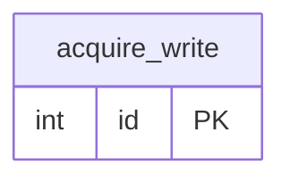

# publish-md-pdf

Render Markdown files to A4-sized PDF, using [pandoc](https://pandoc.org/) with the
[WeasyPrint](https://weasyprint.org/) PDF engine. By default, each `<file>.md` is written as
`<file>.pdf` into the current working directory. Fenced ` ```mermaid ` code blocks are
rendered as actual diagrams — see [Rendering Mermaid diagrams](#rendering-mermaid-diagrams). It can
also convert Markdown to and from Confluence Storage Format (the XHTML-based fragment the Confluence
REST API expects in its `body.storage.value` field) — see
[Converting to/from Confluence](#converting-tofrom-confluence).

Shipped as a container image (`ghcr.io/b-arol-o/publish-md-pdf`) and as a Docker-based GitHub Action,
so it can be used both as a local CLI (via `docker run`) and in CI.

## Usage

### As a CLI (via Docker)

```bash
docker run --rm -v "$PWD:/workspace" ghcr.io/b-arol-o/publish-md-pdf:v1 \
  [--output-dir DIR] [--output-name NAME] [--css-file FILE] <file.md> [file2.md ...]
```

- `--output-dir DIR` — directory to write the PDF(s) into (default: `/workspace`, i.e. the mounted
  `$PWD`). Created if it doesn't already exist.
- `--output-name NAME` — filename for the generated PDF (default: derived from the input `.md`
  filename). Only valid when converting a single input file. `.pdf` is appended automatically if not
  already present.
- `--css-file FILE` — style sheet to use (default: the image's built-in `publish-md-pdf.css`). A
  custom style sheet should keep the `.task-checkbox` rules from the default one (see
  [Notes](#notes)) if the source Markdown has GFM task lists (`- [ ]` / `- [x]`).

Paths outside `$PWD` (a different `--output-dir`, a custom `--css-file`) need their own bind mount,
since the script only sees paths inside the container.

### As a GitHub Action

```yaml
- uses: B-AROL-O/publish-md-pdf@v1
  with:
    files: docs/report.md
    output-dir: dist
```

| Input         | Required | Description                                                                                                 |
| ------------- | -------- | ----------------------------------------------------------------------------------------------------------- |
| `files`       | yes      | Space-separated list of files to convert                                                                    |
| `format`      | no       | `pdf` (default), `confluence`, or `md` — see [Converting to/from Confluence](#converting-tofrom-confluence) |
| `output-dir`  | no       | Directory to write the output file(s) into (default: repository root)                                       |
| `output-name` | no       | Filename for the output; only valid with a single input file                                                |
| `css-file`    | no       | Path to a custom style sheet, relative to the repository root; only used by `pdf`                           |

Uploading or committing the resulting file(s) is the consumer's job (e.g. `actions/upload-artifact`).

## Converting to/from Confluence

`md-to-confluence.sh` and `confluence-to-md.sh` convert between Markdown and Confluence Storage
Format as local file transforms — no Confluence server, credentials, or network access is involved.
The `.confluence` file they read/write is exactly the fragment the Confluence REST API expects in its
`body.storage.value` field, so it can be pasted directly into a page create/update request.

```bash
# Markdown -> Confluence Storage Format
docker run --rm -v "$PWD:/workspace" --entrypoint /usr/local/bin/md-to-confluence.sh \
  ghcr.io/b-arol-o/publish-md-pdf:v1 [--output-dir DIR] [--output-name NAME] <file.md> [file2.md ...]

# Confluence Storage Format -> Markdown
docker run --rm -v "$PWD:/workspace" --entrypoint /usr/local/bin/confluence-to-md.sh \
  ghcr.io/b-arol-o/publish-md-pdf:v1 [--output-dir DIR] [--output-name NAME] \
  <file.confluence> [file2.confluence ...]
```

Or via the GitHub Action, with `format: confluence` or `format: md`:

```yaml
- uses: B-AROL-O/publish-md-pdf@v1
  with:
    files: docs/report.md
    format: confluence
```

Known limitations of this conversion (see also [Notes](#notes)):

- Code blocks become Confluence's `code` structured macro, preserving the fenced code block's
  language; a fenced code block with no language round-trips as an indented code block instead of a
  fenced one (both are valid Markdown, only the presentation differs).
- Task-list checkboxes (`- [ ]` / `- [x]`) become the ballot-box characters `☐`/`☒`, since Confluence
  Storage Format has no native checkbox element and this keeps the content readable as plain text.
- Other Markdown constructs (headings, tables, links, images, blockquotes, emphasis, nested lists) map
  onto their closest plain XHTML equivalent. Images become a plain ``, not Confluence's
  attachment-backed `ac:image` macro, since there's no attachment to point at in a file-only
  conversion.
- This only round-trips content produced by these two scripts; storage-format XHTML written by hand or
  exported from a real Confluence page may use macros or attributes these scripts don't recognize.

For a step-by-step guide to getting the resulting `.confluence` file into a real Confluence Cloud page
(via the web UI or the REST API), see
[docs/import-to-confluence-cloud.md](docs/import-to-confluence-cloud.md).

## Rendering Mermaid diagrams

Fenced code blocks with the `mermaid` language (` ```mermaid `) are rendered as an actual
diagram image, not literal diagram source. Rendering runs entirely locally: the image bundles
[mermaid-cli](https://github.com/mermaid-js/mermaid-cli) (`mmdc`) and a Chromium build for it to
drive, so diagram source never leaves the container.

````markdown

````

Notes and limitations:

- Diagrams are embedded as PNG, not SVG: mermaid-cli's SVG output places labels in
  `<foreignObject>` (embedded XHTML), which WeasyPrint's SVG renderer doesn't support and leaves
  every label blank; PNG goes through Chromium's own compositing, so labels always render. This
  makes diagram text non-selectable in the resulting PDF, unlike the rest of the document.
- A large or deeply-nested diagram can be taller than one page; it paginates like any other large
  image or table rather than being scaled down to force a fit.
- If `mmdc` isn't on `PATH` (e.g. running `publish-md-pdf.sh` directly on a host without it
  installed, rather than via the Docker image), `mermaid` code blocks fall back to rendering as
  plain code, matching this tool's behavior before this feature existed.

## Building the image locally

```bash
docker build -t publish-md-pdf .
docker run --rm -v "$PWD:/workspace" publish-md-pdf sample.md
```

## Notes

- Page layout (A4 size, margins, page-number footer, code-block wrapping) is defined in
  `publish-md-pdf.css`.
- Task-list checkboxes (`- [ ]` / `- [x]`) are rendered as `<span class="task-checkbox">` markers
  instead of native `<input type="checkbox">` elements, because WeasyPrint always fills a checked
  native checkbox solid black and ignores CSS overrides on it. A custom `--css-file` needs its own
  `.task-checkbox` / `.task-checkbox.checked` rules to render task lists (see `publish-md-pdf.css`
  for a working example); otherwise the checkboxes render as empty, unstyled markers.
- If the Markdown file has a YAML front matter `title:` field, it is used as the PDF's document title
  metadata.

## License

[MIT](LICENSE)

<!-- EOF -->
