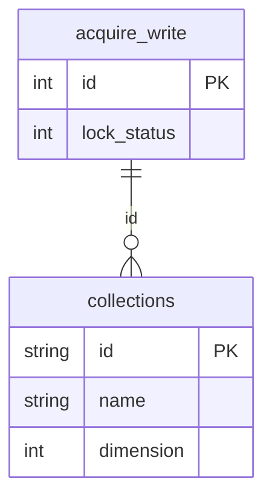

# Mermaid diagram sample

This file exercises Mermaid diagram rendering (see the "Rendering Mermaid diagrams" section
of the README) and is used by CI as a smoke test.

## Entity-Relationship Diagram

<!-- EOF -->
